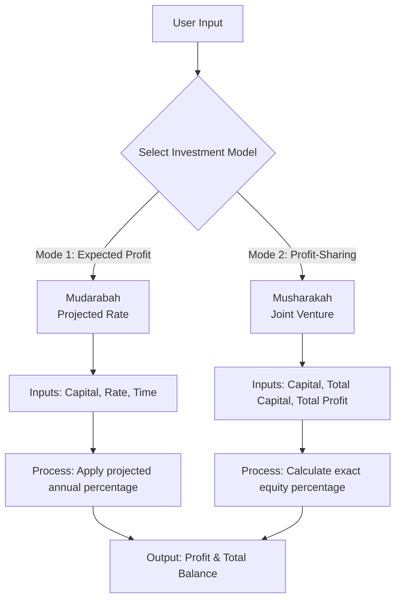
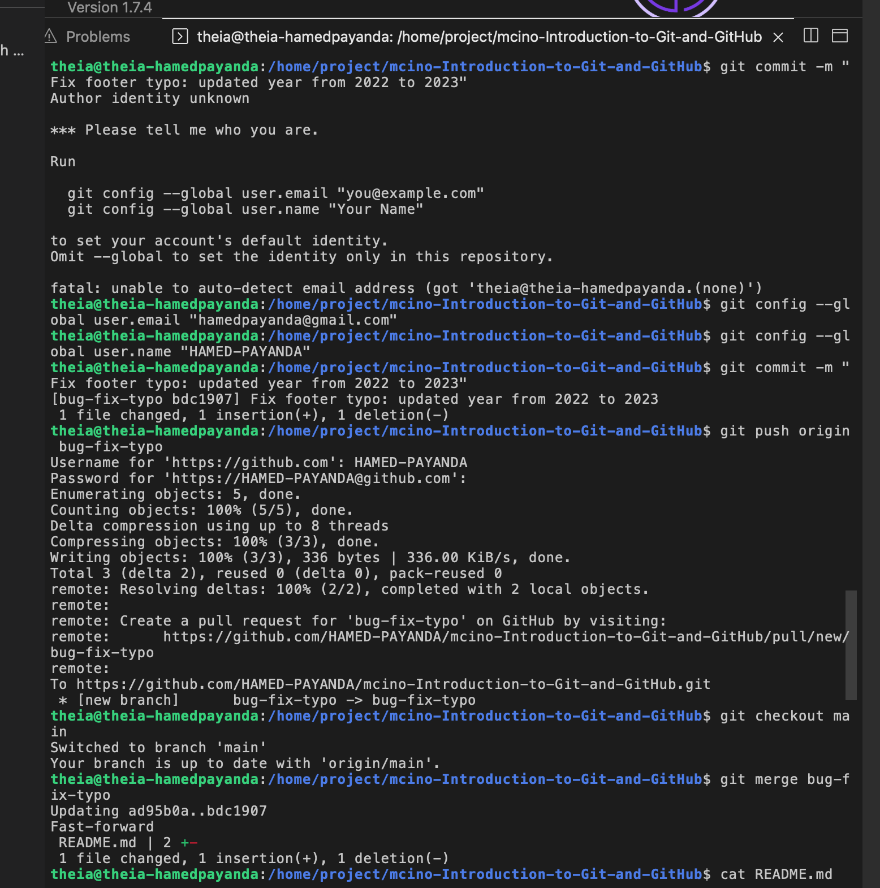

<div align="center">

# 🧮 Halal Investment Calculator

A financial calculator designed to replace traditional interest-based (Riba) models with an ethical, Islamic investment (profit-sharing) framework.

[](https://www.python.org/)
[](#)
[](#)
[](https://www.coursera.org/professional-certificates/ibm-full-stack-cloud-developer)
[](https://git-scm.com/)
[](https://github.com/features/actions)
[](#)

</div>

---

## 📌 Project Overview

This repository features a localized, simple investment calculator built on **Islamic Finance** principles. Instead of utilizing standard compound or simple interest formulas—which rely on predetermined risk-free rates—this application models real-world business partnerships. 

The calculator provides two distinct modes to calculate financial growth: a projected profit rate model, and a dynamic partnership (profit-sharing) model based on actual business performance.

---

## 🕌 Islamic Finance Principles

This project strictly avoids traditional interest (*Riba*) and is instead grounded in ethical business frameworks:
* **Mudarabah (Profit-Sharing):** A financial partnership where one party provides capital and the other provides expertise, sharing generated profits based on a pre-agreed ratio.
* **Musharakah (Joint Venture):** A joint enterprise in which all partners share the profit or loss of the joint business according to their initial capital contribution.

---

## 🏗️ Application Workflow



---

## 🎛️ Calculator Inputs & Outputs

### System Inputs
| Variable | Name | Description | Used In |
| :--- | :--- | :--- | :--- |
| **`p`** | Capital Investment | Your individual financial contribution | Both Modes |
| **`pr`** | Profit Rate | Expected annual profit rate percentage | Mode 1 |
| **`t`** | Time Period | Duration of the investment in years | Mode 1 |
| **`total_investment`** | Total Business Capital | The combined capital from all partners | Mode 2 |
| **`tp`** | Total Business Profit| The actual monetary profit earned by the business | Mode 2 |

### System Outputs
* **Profit:** Your calculated share of the gains from the investment.
* **Total:** Your original capital investment plus your generated profit.

---

## 🧮 Mathematical Models

### Mode 1: Expected Profit Rate
Used for forecasting based on a projected annual profit percentage.

* **Profit** = `p` × (`pr` / 100) × `t`
* **Total** = `p` + **Profit**

### Mode 2: Partnership (Profit-Sharing)
Used for exact dividend calculations based on the percentage of capital owned in a joint venture.

* **Profit Share** = (`p` / `total_investment`) × `tp`
* **Total** = `p` + **Profit Share**
---

## 📸 Visual Proof

**Version Control & Development Workflow**  
*A terminal view demonstrating the Git version control workflow utilized during the development of this project. It highlights best practices such as configuring developer identity, creating isolated branches for bug fixes, pushing to the remote repository, and performing fast-forward merges back to the `main` branch.*


---

## 📁 Repository Structure

```text
simple-investment-calculator/
├── CODE_OF_CONDUCT.md         # Community guidelines for contributors
├── CONTRIBUTING.md            # Instructions for contributing to the project
├── demo1.png                  # Visual proof of the development/Git workflow
├── investment-profit.sh       # Bash script implementation of the calculator
├── islamic_investment.py      # Core Python calculation logic and application
├── LICENSE                    # Apache 2.0 License file
└── README.md                  # Project documentation
```
---

## ⚙️ Quick Start Usage
To run the calculator locally, ensure you have Python 3 installed on your machine.

1.	Clone the repository:
```bash
git clone [https://github.com/HAMED-PAYANDA/simple-investment-calculator.git](https://github.com/HAMED-PAYANDA/simple-investment-calculator.git)
```
2.	Navigate to the directory:
```bash
cd simple-investment-calculator
```

3.	Execute the Python script:
```bash
python3 islamic_investment.py
```
4. (Optional) Execute the Bash script:
```bash
chmod +x investment-profit.sh
./investment-profit.sh
```

---

## License

This project is licensed under the [Apache 2.0 License](LICENSE).

## 👤 Author

**Hamed Payanda**
* **GitHub:** [@HAMED-PAYANDA](https://github.com/HAMED-PAYANDA)
* Developed to bridge algorithmic logic with ethical financial models.
* Completed as part of the **IBM Full-Stack Software Developer Professional**.

